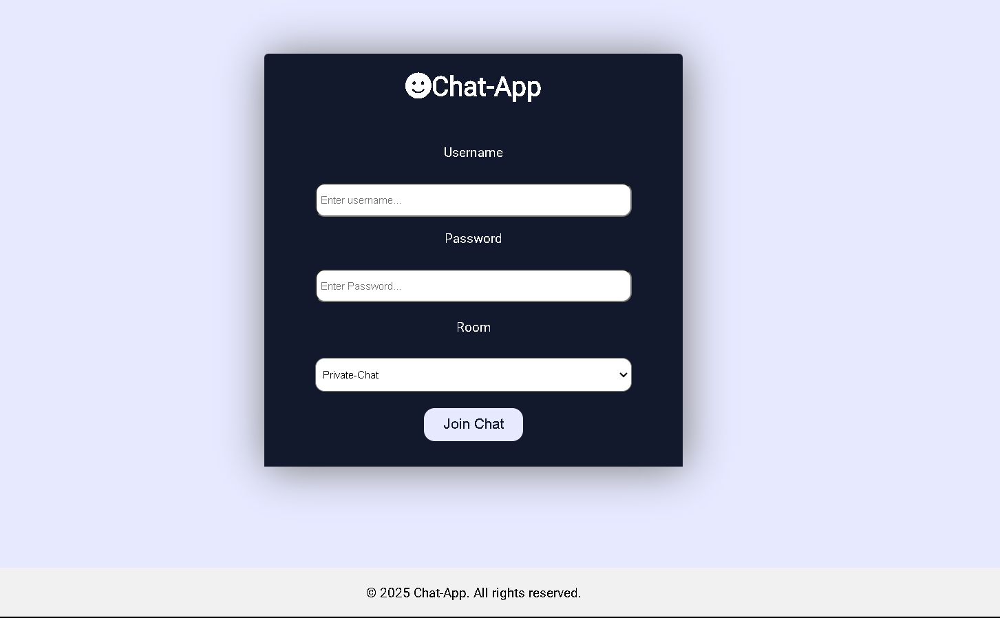
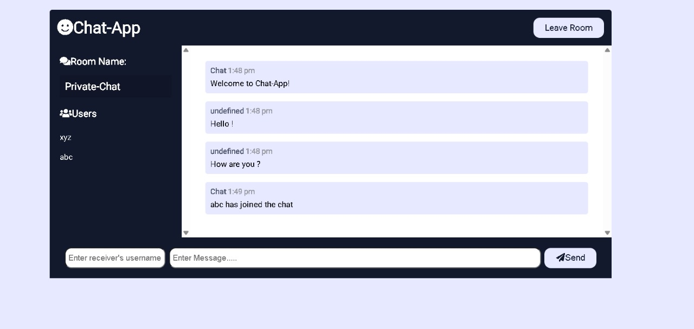
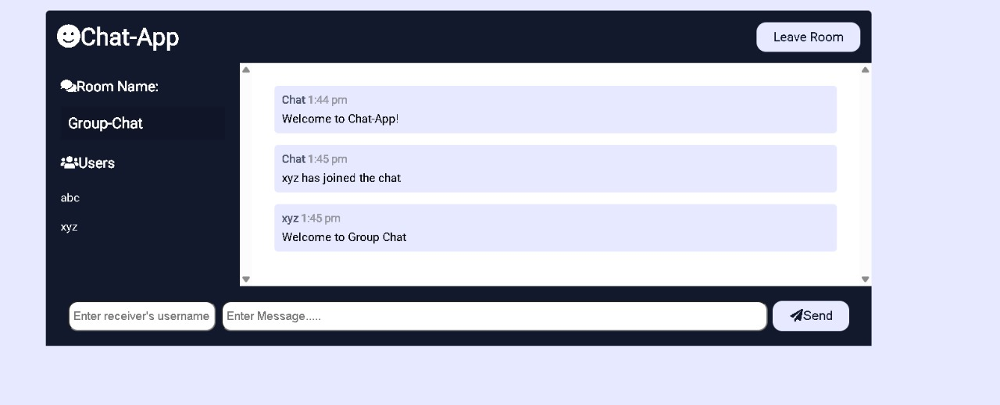

# 🚀 Chat-Room Application

A real-time chat-room application built using **Socket.IO**, **Node.js**, **MySQL**, **Redis**, and a frontend powered by **HTML**, **CSS**, and **JavaScript**.  
It supports **multiple chat rooms**, **private chats**, and **real-time communication** with **user authentication**.

> **Project Status:** Final Year College Project 🎓 | Future features in progress...

---

## 📸 Screenshots

### 🛢️ Login Page


---

### 🔒 Private Chat


---

### 👥 Group Chat


---

## ✨ Features

- 🔵 Real-time messaging with **Socket.IO**
- 🚱️ User authentication via **MySQL**
- 🗣️ Multiple chat rooms support
- 🔐 Private one-on-one chatting
- 🚀 Redis integration for efficient broadcasting
- 🟢 User online/offline status tracking

---

## 🛠️ Technologies Used

| Frontend         | Backend          | Database     | Real-Time Server  |
| ---------------- | ---------------- | ------------ | ----------------- |
| HTML, CSS, JS    | Node.js, Express  | MySQL        | Socket.IO, Redis   |

---

## 📥 Installation & Setup Guide

### Prerequisites:
- Node.js
- MySQL
- Redis Server

---

### 1. Clone the Repository

```bash
git clone https://github.com/iadnan172/Chat-Room.git
cd Chat-Room
```

---

### 2. Install Node.js Dependencies

```bash
npm install
```

---

### 3. Setup MySQL Database
- Create a MySQL database (example: `chat_app`).
- Update database credentials in your `.env` file.

---

### 4. Run Redis Server
Ensure Redis is installed and start the server:

```bash
redis-server
```

---

### 5. Start the Application

```bash
npm run dev
```

---

### 6. Access Application
Open your browser and navigate to:

```
http://localhost:4000
```

---

## 🔑 Environment Variables

Create a `.env` file in the project root and add:

```plaintext
DB_HOST=localhost
DB_USER=root
DB_PASSWORD=yourpassword
DB_NAME=chat_app
REDIS_HOST=localhost
REDIS_PORT=6379
```

---

## 📂 Folder Structure

```
/chat-room
│—— /public
│   ├—— /css
│   │   ├—— styles.css
│   ├—— /js
│   │   ├—— main.js
│   ├—— index.html
│   ├—— chat.html
│—— /utils
│   ├—— message.js
│   ├—— users.js
│—— server.js
│—— package.json
│—— .env
│—— README.md
```

---

## 🚀 Future Enhancements

- 📷 Media Sharing (Images, Files, Videos)
- 🔐 JWT Authentication
- 🔐 End-to-End Message Encryption
- ☁️ Cloud Deployment (AWS/GCP)

---

## 📝 License

This project is licensed under the **MIT License**.  
Feel free to use, modify, and distribute.

---

## 👌 Contributions

Contributions, issues, and feature requests are welcome!  
Feel free to open a **Pull Request** or **Issue**.

---

## ✨ About Me

Developed by **Adnan Pathan** — Computer Science Student 👨‍💻  
> "Building real-world projects to sharpen skills and inspire others."

---

# Thank You! 🙏

---


