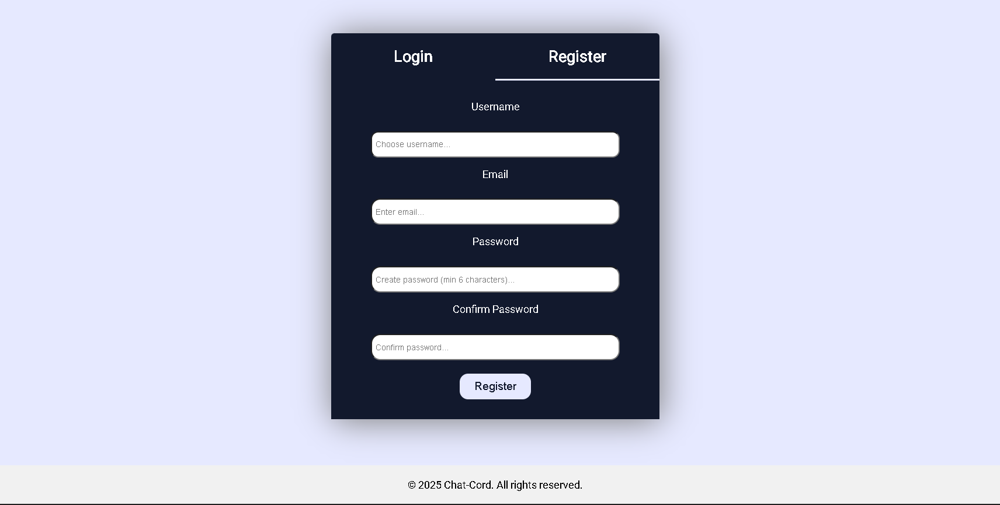
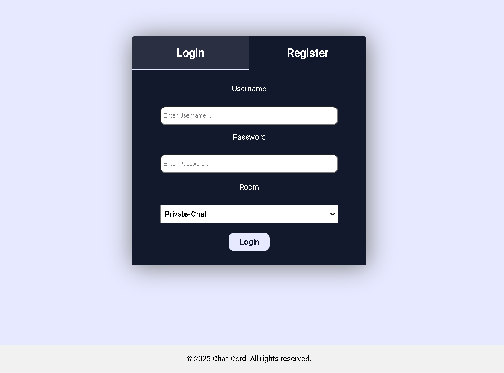
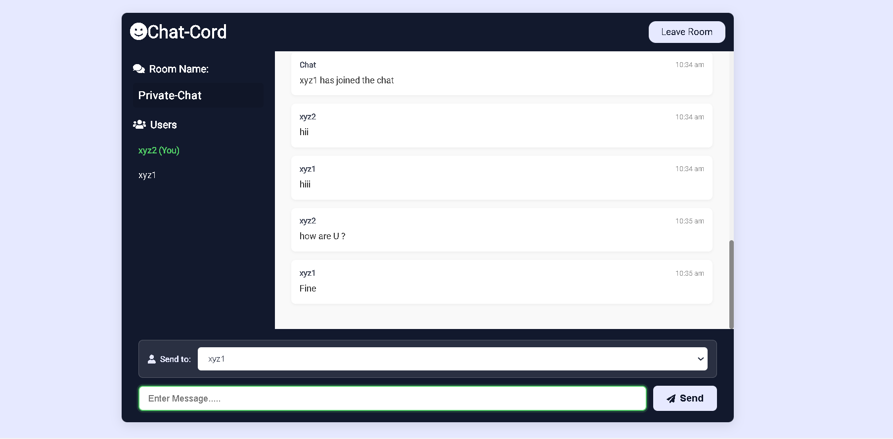
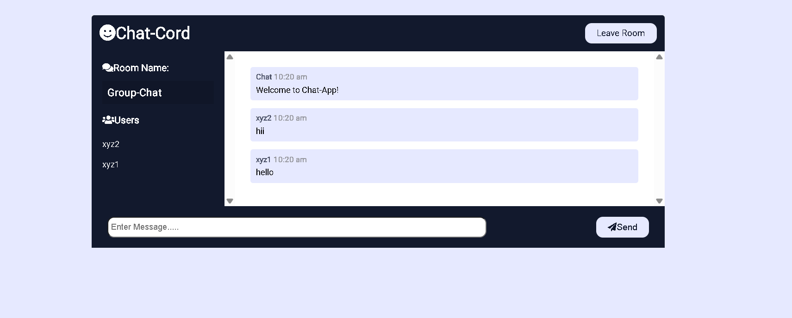

# 🚀 Chat-Room Application

A real-time chat-room application built using **Socket.IO**, **Node.js**, **MySQL**, **Redis**, and a frontend powered by **HTML**, **CSS**, and **JavaScript**.  
It supports **multiple chat rooms**, **private chats**, and **real-time communication** with **user authentication**.

> **Project Status:** Final Year College Project 🎓 | Future features in progress...

---

## 📸 Screenshots

### 🔒 Registration 


### 🛢️ Login Page


---

### 🔒 Private Chat


---

### 👥 Group Chat


---

## ✨ Key  Features

## 🔐 Authentication & Security

- **JWT**-based authentication
- Password hashing using **bcrypt**
- Role-based route protection
- Secure session handling
- Token verification middleware

## 💬 Chat System

- Real-time messaging using **Socket.IO**
- Private chat (User → User chat with dropdown)
- Group chat (Broadcast to all online users)
- Message persistence using **MySQL**
- Automatic chat history loading
- Typing indicators (optional)
- Read receipts (optional extension)

## 👥 User Management

- Online/offline status tracking (Redis-powered)
- Live user list updates
- Current user highlighting
- Profile-based chat identification
- Prevent duplicate logins (optional)

---

## 🛠️ Technologies Used

| Frontend         | Backend                | Database     | Real-Time Server  |
| ---------------- | -----------------------| ------------ | ----------------- |
| HTML, CSS, JavaScript (Vanilla)    | Node.js, Express, JWT  | MySQL        | Socket.IO, Redis   |

---

## 📥 Installation & Setup Guide

### Prerequisites:
- Node.js
- MySQL
- Redis Server

---

### 1. Clone the Repository

```bash
git clone https://github.com/iadnan172/Chat-Room.git
cd Chat-Room
```

---

### 2. Install Node.js Dependencies

```bash
npm install
```

---

### 3. Setup MySQL Database
- Create a MySQL database (example: `chat_app`).
- Update database credentials in your `.env` file.

---

### 4. Run Redis Server
Ensure Redis is installed and start the server:

```bash
redis-server
```

---

### 5. Start the Application

```bash
npm run dev
```

---

### 6. Access Application
Open your browser and navigate to:

```
http://localhost:4000
```

---

## 🔑 Environment Variables

Create a `.env` file in the project root and add:

```plaintext
DB_HOST=localhost
DB_USER=root
DB_PASSWORD=yourpassword
DB_NAME=chat_app
REDIS_HOST=localhost
REDIS_PORT=6379
```

---

## 📂 Folder Structure

```
chat-room/
│
├── backend/
│   ├── server.js
│   ├── routes/
│   ├── controllers/
│   ├── models/
│   ├── middleware/
│   └── config/
│
├── frontend/
│   ├── index.html
│   ├── chat.html
│   ├── login.html
│   ├── register.html
│   ├── css/
│   └── js/
│
├── docker/
│   ├── Dockerfile
│   ├── docker-compose.yml
│
├── kubernetes/
│   ├── deployment.yaml
│   ├── service.yaml
│   └── ingress.yaml
│
└── README.md
```

---

## 🚀 Future Enhancements

- 📷 Media Sharing (Images, Files, Videos)
- 🔐 JWT Authentication
- 🔐 End-to-End Message Encryption
- ☁️ Cloud Deployment (AWS/GCP)

---

## 📝 License

This project is licensed under the **MIT License**.  
Feel free to use, modify, and distribute.

---

## 👌 Contributions

Contributions, issues, and feature requests are welcome!  
Feel free to open a **Pull Request** or **Issue**.

---

## ✨ About Me

Developed by **Adnan Pathan** — Computer Science Student 👨‍💻  
> "Building real-world projects to sharpen skills and inspire others."

---

# Thank You! 🙏

---


